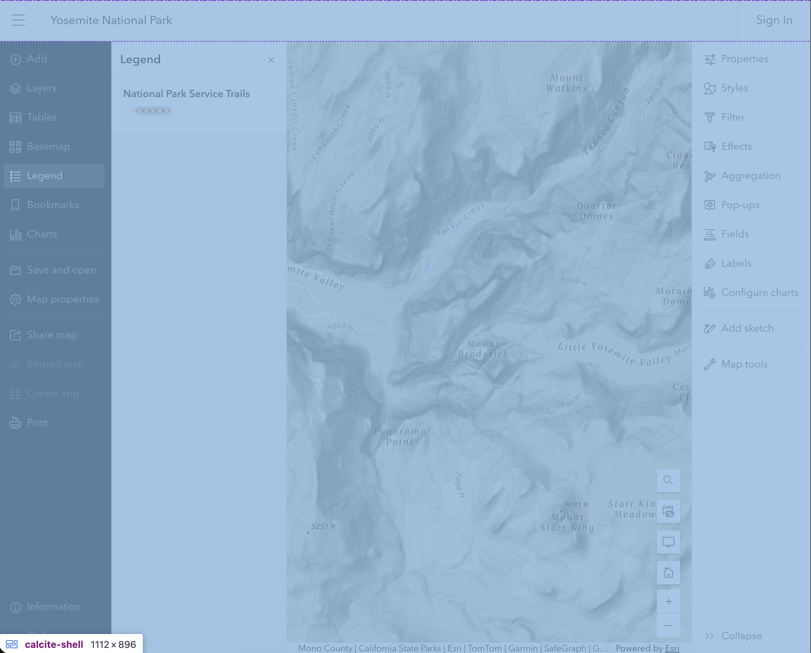
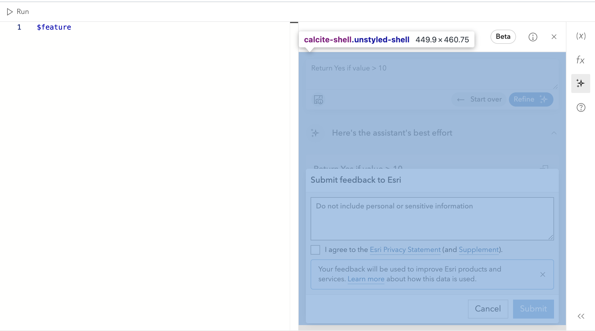

<!--
- Speaker: Nick
-->

## ArcGIS Maps SDK for JavaScript: App Development with Components, Part 3: User Experience

Adam Tirella, Nicholas Romano, Kitty Hurley

---
is: feedback
---

---

<!--
- Speaker: Nick
-->

# Previous session (yesterday)

App Development with Components Part 2: Using Frameworks

> The session touches on current front-end methodologies for topics such as
> dependency management, asset management, semantic versioning, prebuilt versus
> built applications that scale, and conveniences offered by frameworks that
> streamline web mapping app development compared to plain JavaScript.

If you missed the previous session, we have a recording. These 4-part sessions
build on top of each other

---

<!--Speaker: Nick-->

# Today's session

3rd in a 4-part series

- We will cover:
  - `calcite-components` - creating a layout
  - `@arcgis/map-components` - utilizing slots within the map component
  - `@arcgis/map-components` - reference-element property
  - Utilizing both within a demo application to develop composable UI elements

---

<!--Speaker: Nick-->

# What you'll get from this session

- A simple mental model for building UI with web components
- A practical layout pattern using Calcite (shell + panels)
- How ArcGIS map components fit into that layout (and how slots help)
- Demo of building a map-centered app with these ideas

---
layout: two-cols-header
---

<!--Speaker: Adam-->

# Getting started: Calcite shell component

::left::

- The `calcite-shell` component provides a flexible layout for your application,
  with slots for a header, footer, and main content area.
- It's the foundational component for building a consistent and responsive user
  interface in your web app, allowing you to easily organize your content and
  components.
- It provides slots for embedding additional calcite components, such as
  navigation, panels, and more, making it easy to create a cohesive user
  experience.

::right::

---

<!--Speaker: Adam-->

# Slots - What are they?

- A slot is a placeholder inside a web component that you can fill with your own
  markup, which can include other components.
- Components can have multiple slots, and you can choose which slot to fill with
  your content.
- This allows for greater flexibility and customization when using web
  components

---

<!--Speaker: Adam-->

# Calcite shell slots - visualized

- https://developers.arcgis.com/calcite-design-system/foundations/layouts/#shell-slots

---
layout: two-cols-header
---

<!--Speaker: Adam-->

# Shell recap

::left::

- The `calcite-shell` component provides a flexible layout for your application,
  with slots for a navigation header, main content area, and optional side
  panels.

- It can also be used in other parts of your page, providing structure to easily
  organize components like alerts, modals, and more.

::right::

---

<!--Speaker: Nick-->

# Map Components and Slots

- the `arcgis-map` component has named slots available to place content in
  specific areas of the map, such as the top-left, top-right, bottom-left, and
  bottom-right corners of the map view
- https://developers.arcgis.com/javascript/latest/references/map-components/components/arcgis-map/#slots

---

<!--Speaker: Nick-->

# Reference Element

- Both calcite-components and map-components expose reference-element properties
- They serve slightly differing purposes:
  - In calcite components - they are used to position overlays like tooltips and
    popovers relative to a reference element
  - In map components - they are used to link a UI component to a map or scene
    component.
  - We'll show examples of both in our demo

---
layout: statement
---

<!--Speaker: Nick-->

# Now that we know the basics, lets build an app!

---
layout: image-right
image: ./assets/morel.jpeg
backgroundSize: 20em 70%
---

<!--Speaker: Nick-->

# App requirements

- Adam and I both live in Portland, Oregon, known for it's foraging
  opportunities
- Spring is coming and that typically means Morels are going to start popping up

---
layout: statement
---

<!--
- Speaker: Nick-->

## Let's create an app that explores where Morels might be popping up based on environmental conditions

---
layout: image-right
image: ./assets/burned-tree.jpg
backgroundSize: 20em 90%
---

<!--Speaker: Nick-->

# Criteria for Morels

- In the west, Morels are easiest to find in areas that have recently
  experienced a fire
- They seem to like an elevation > 2500ft and < 6000ft
- Needs to be public land (e.g. national forest)
- We need to be able to access the area by road or trail

---

<!--Speaker: Nick-->

# Design criteria

- We want to be able to easily toggle on and off different layers of data
- Want to visualize recent fires, elevation, and public lands, trails, and
  access points
- We want to be able to click on the map and get information about the location,
  such as:
  - nearby trails
  - elevation
  - whether it's accessible public lands

---

<!--
- Speaker: Adam
- Touch points: simply explain the shell, how we use the slots on the map components. This is a quicky demo
-->

# Demo step: layout placeholders

- Demo folder: `demo/00-layout`
- Header slot (navbar): app title + branding area
- Map `top-left` slot: placeholder UI for quickly toggling layers on/off
- Map `top-right` slot: placeholder UI for nearby trails, elevation, and access
  info

---

<!--
- Speaker: Adam
- Touch points: start building out the left panel with real calcite components. Feel free to edit the demo to suite your flow. Touch on the different components used. Quickly show the use of "scale" prop on calcite components and how it can be used to adjust the size of components in a more compact UI like a panel.
-->

# Demo step: rich left panel (Calcite)

- Demo folder: `demo/00-left-panel`

---

<!--
- Speaker: Nick
- Touch points: build a react component that is used multiple times in the right panel. Explain the action and how we use it to trigger the display of additional information in the panel. Show how we use the reference element prop to link the action button to the sheet that has the arcgis-features component.
-->

# Demo step: rich right panel (Custom UI Components)

- Demo folder: `demo/00-right-panel`

- Calcite tile
  https://developers.arcgis.com/calcite-design-system/components/tile/
- Calcite meter
  https://developers.arcgis.com/calcite-design-system/components/meter/

---

# Morel of the story... (Recap)

<!--Speaker: Nick-->

- Map and Calcite components can build rich user experiences
- We can use reference-element propertyies

---

# Next session

[ArcGIS Maps SDK for JavaScript: App Development with Components, Part 4: Extending and Styling](https://registration.esri.com/flow/esri/26epcdev/deveventportal/page/detailed-agenda/session/1761122138829001Iinc)

**When**: This afternoon (Thursday, March 12) | 1:00 - 2:00PM PDT

**Where**: Primrose A | Palm Springs Convention Center

> Join us for the fourth technical session in a four-part series on building
> applications with the ArcGIS Maps SDK for JavaScript. This session showcases
> branding and styling strategies to create rich theming and customization in
> your apps using Calcite design tokens and ArcGIS Maps SDK for JavaScript
> component tokens. Explore how you can use light and dark modes in your app
> that will apply to both Calcite and SDK components. Finally, learn how you can
> use component slots for integrating your custom workflows and further tune
> your app's UI/UX.

---
layout: center
---

# Questions?

ArcGIS Maps SDK for JavaScript: App Development with Components, Part 3: Using
Frameworks

Demos and additional resources available at: TODO: Link

TODO: QR code

<!--
If you wish to dive deeper, you can find our demos and
additional resources at the URL above, or you can scan the QR code.
-->

---
src: ../.meta/footer.md
---
