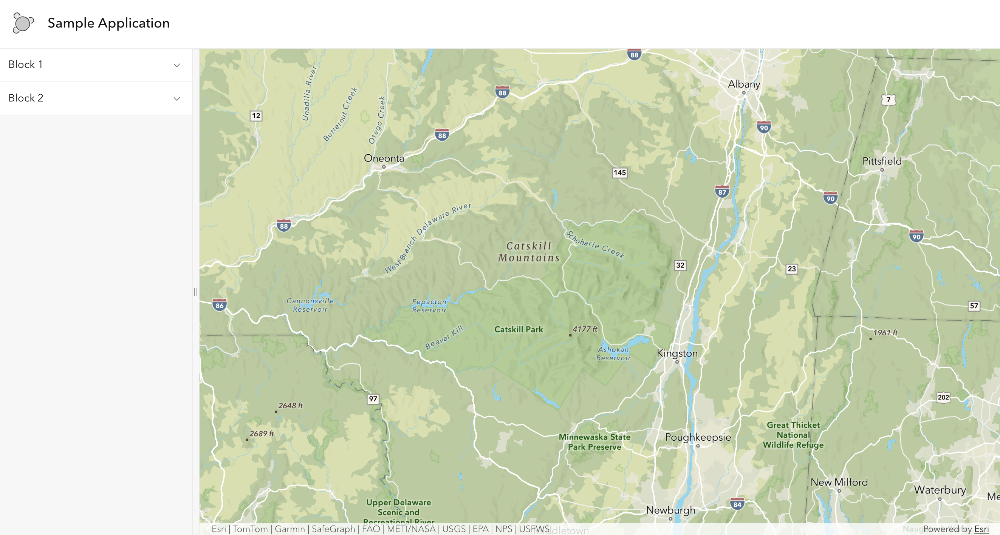
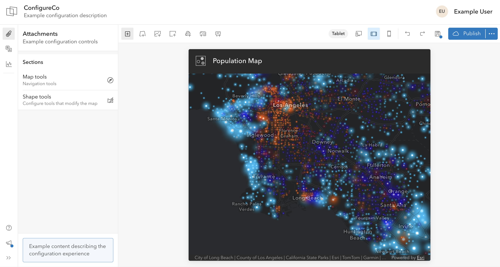
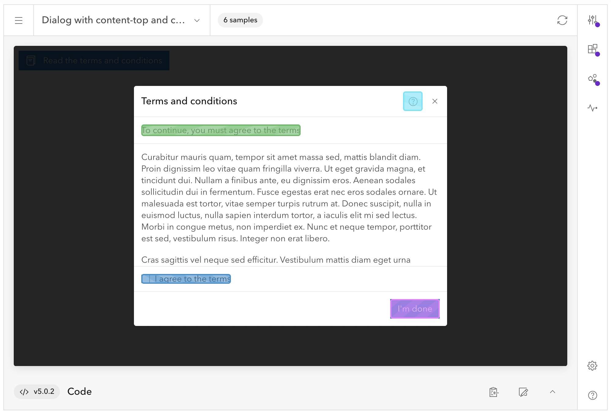
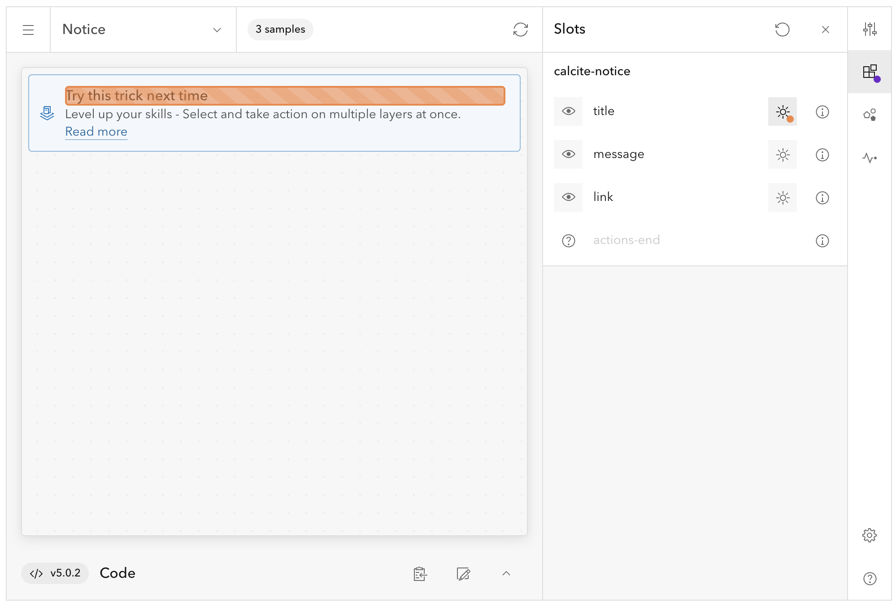
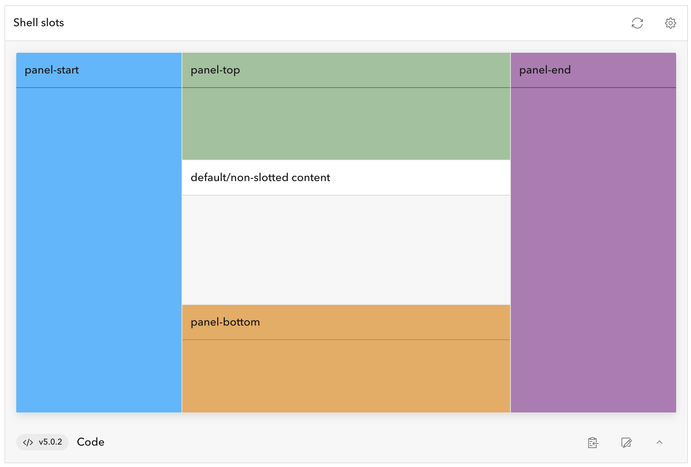
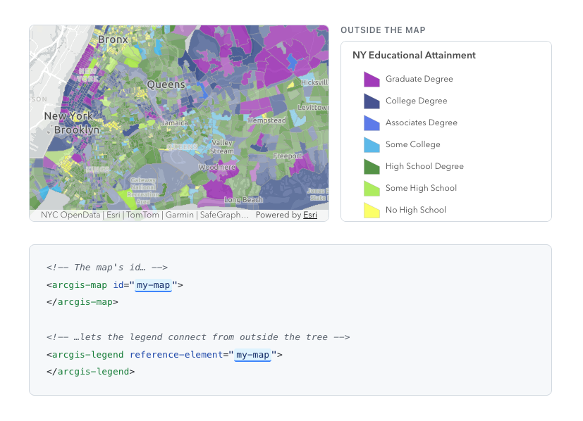
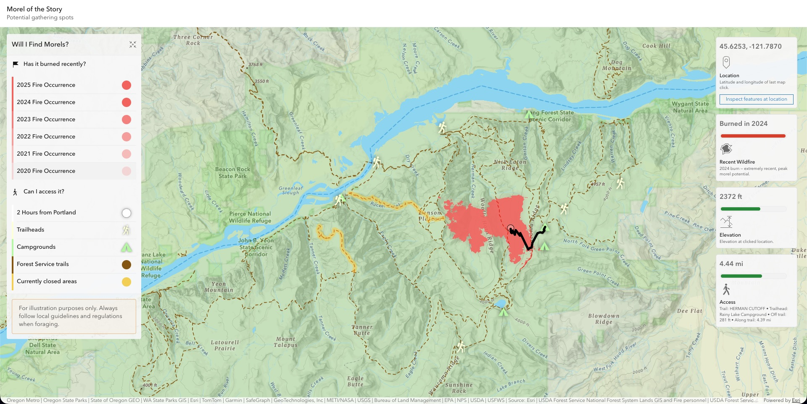

<!--
- Speaker: Nick
-->

## ArcGIS Maps SDK for JavaScript: App Development with Components, Part 3: User Experience

Adam Tirella, Nicholas Romano, Kitty Hurley

---
is: feedback
---

---

<!--
- Speaker: Nick
-->

# Previous session (yesterday)

App Development with Components Part 2: Using Frameworks

> The session touches on current front-end methodologies for topics such as
> dependency management, asset management, semantic versioning, prebuilt versus
> built applications that scale, and conveniences offered by frameworks that
> streamline web mapping app development compared to plain JavaScript.

If you missed the previous session, we have a recording. These 4-part sessions
build on top of each other

---

<!--Speaker: Nick-->

# Today's session

3rd in a 4-part series

- We will cover:
  - `calcite-components` - creating a layout
  - `@arcgis/map-components` - utilizing slots within the map component
  - `@arcgis/map-components` - reference-element property
  - Utilizing both within a demo application to develop composable UI elements

---

<!--Speaker: Nick-->

# What you'll get from this session

- A simple mental model for building UI with web components
- A practical layout pattern using Calcite (shell + panels)
- How ArcGIS map components fit into that layout (and how slots help)
- Demo of building a map-centered app with these ideas

---
layout: two-cols-header
---

<!--Speaker: Adam-->

# Shell component

::left::

- `calcite-shell`
- Flexible layout container for your application
- Provides slots to organize content and controls

::right::

---
layout: two-cols-header
---

<!--Speaker: Adam-->

# Shell component

::left::

- Supports simple and complex layouts
- Can be nested and embedded
- Can be the entire app or part of an app
- Pair with `arcgis-map` and `arcgis-scene`

::right::

---
layout: two-cols-header
---

<!--Speaker: Adam-->

# Learning about slots

::left::

- Simply, a place to put things
- Core web component capability like events, methods, and properties
- Intentionally position content, controls, and components

- [Calcite docs - slots as a core concept](https://developers.arcgis.com/calcite-design-system/core-concepts/#slots)

::right::

---
layout: two-cols-header
---

<!--Speaker: Adam-->

# Slots in Shell

::left::

- `panel-start`, `panel-end`, `panel-top`, and `panel-bottom`, `header` and
  `footer` slots organize content
- Use with Shell Panels, Panels, and Blocks to organize content and controls
- Default slot for `arcgis-map`, `arcgis-scene`, or other content

- [Calcite docs - layout + shell slots](https://developers.arcgis.com/calcite-design-system/foundations/layouts/#shell-slots)
- [Calcite docs - sample code](https://developers.arcgis.com/calcite-design-system/sample-code)

::right::

---

<!--Speaker: Nick-->

# Map Components and Slots

- the `arcgis-map` component has named slots available to place content in
  specific areas of the map, such as the top-left, top-right, bottom-left, and
  bottom-right corners of the map view
- https://developers.arcgis.com/javascript/latest/references/map-components/components/arcgis-map/#slots

---
layout: image-right
image: ./assets/calcite-tooltip-reference-element.gif
backgroundSize: 65%
---

<!--Speaker: Nick-->

# Reference Element

- Both Calcite and Map Components expose reference-element properties
- They serve slightly differing purposes:
  - <b>Calcite</b> - position an element relative to another element (e.g.
    tooltip to button)
  - <b>Map Components</b> - link a "furniture" component to a arcgis-map or
    arcgis-scene component

---

# Map components and reference element

---
layout: statement
---

<!--Speaker: Nick-->

# Now that we know the basics, lets build an app!

---
layout: image-right
image: ./assets/morel.jpeg
backgroundSize: 20em 70%
---

<!--Speaker: Nick-->

# App requirements

- Adam and I both live in Portland, Oregon, known for it's foraging
  opportunities
- Spring is coming and that typically means Morels are going to start popping up

---
layout: statement
---

<!--
- Speaker: Nick-->

## Let's create an app that explores where Morels might be popping up based on environmental conditions

---
layout: image-right
image: ./assets/burned-tree.jpg
backgroundSize: 20em 90%
---

<!--Speaker: Nick-->

# Criteria for Morels

- In the west, Morels are easiest to find in areas that have recently
  experienced a fire
- Ideal elevation of > 2500ft and < 6000ft
- Within public land (e.g. national forest)
- Accessible via public trailhead / campsite
- Within a 2 hour drive from Portland

---

<!--Speaker: Nick-->

# Design criteria

- We want to be able to easily toggle on and off different layers of data
- Want to visualize recent fires, elevation, and public lands, trails, and
  access points.
- We want to be able to click on the map and get information about the location,
  such as:
  - nearby trails
  - elevation
  - if it is public land

---

<!--
- Speaker: Adam
- Touch points: simply explain the shell, how we use the slots on the map components. This is a quicky demo
-->

# Demo step: layout placeholders

- Demo folder: `demo/00-layout`
- Shell `header` slot: Calcite Navigation + Logo
- Shell default slot: `arcgis-map` component
- Map `top-left` slot: Calcite Panel placeholder
- Map `top-right` slot: Calcite Panel placeholder

---

<!--
- Speaker: Adam
- Touch points: start building out the left panel with real calcite components. Touch on the different components used. Use List Item slots and List configuration for a unique interactive legend display.
-->

# Demo step: interactive left panel

- Demo folder: `demo/00-left-panel`
- Build an interactive legend
- Adapt layout for smaller viewport sizes
- Use slots to arrange content and controls
- Use events to respond to user interaction
- [Calcite docs - Panel](https://developers.arcgis.com/calcite-design-system/components/panel/)
- [Calcite docs - Block](https://developers.arcgis.com/calcite-design-system/components/block/)
- [Calcite docs - List](https://developers.arcgis.com/calcite-design-system/components/list/)

---

<!--
- Speaker: Nick
- Touch points: build a react component that is used multiple times in the right panel. Explain the action and how we use it to trigger the display of additional information in the panel. Show how we use the reference element prop to link the action button to the sheet that has the arcgis-features component.
-->

# Demo step: rich right panel (Custom UI Components)

- Demo folder: `demo/00-right-panel`

- Calcite tile
  https://developers.arcgis.com/calcite-design-system/components/tile/
- Calcite meter
  https://developers.arcgis.com/calcite-design-system/components/meter/

---

# Morel of the story... (Recap)

<!--Speaker: Nick-->

- Great, map-centric apps are built with a combination of cartography, data, and
  user experience
- Web components are a powerful tool to build unique user experiences that help
  craft a story around your data and map

---

# Next session

[ArcGIS Maps SDK for JavaScript: App Development with Components, Part 4: Extending and Styling](https://registration.esri.com/flow/esri/26epcdev/deveventportal/page/detailed-agenda/session/1761122138829001Iinc)

**When**: This afternoon (Thursday, March 12) | 1:00 - 2:00PM PDT

**Where**: Primrose A | Palm Springs Convention Center

> Join us for the fourth technical session in a four-part series on building
> applications with the ArcGIS Maps SDK for JavaScript. This session showcases
> branding and styling strategies to create rich theming and customization in
> your apps using Calcite design tokens and ArcGIS Maps SDK for JavaScript
> component tokens. Explore how you can use light and dark modes in your app
> that will apply to both Calcite and SDK components. Finally, learn how you can
> use component slots for integrating your custom workflows and further tune
> your app's UI/UX.

---
layout: center
---

# Questions?

ArcGIS Maps SDK for JavaScript: App Development with Components, Part 3: User
Experience

Demos and additional resources available at:
https://github.com/nick-romano/esri-dev-summit-presentations-2026/tree/main/2026/using-components-3

<!--
If you wish to dive deeper, you can find our demos and
additional resources at the URL above, or you can scan the QR code.
-->

---
src: ../.meta/footer.md
---
